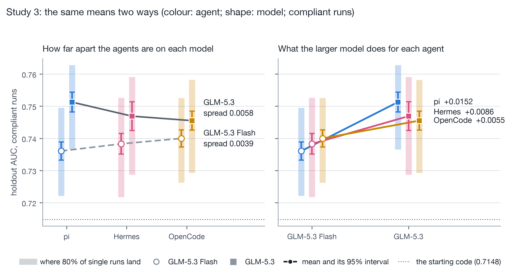
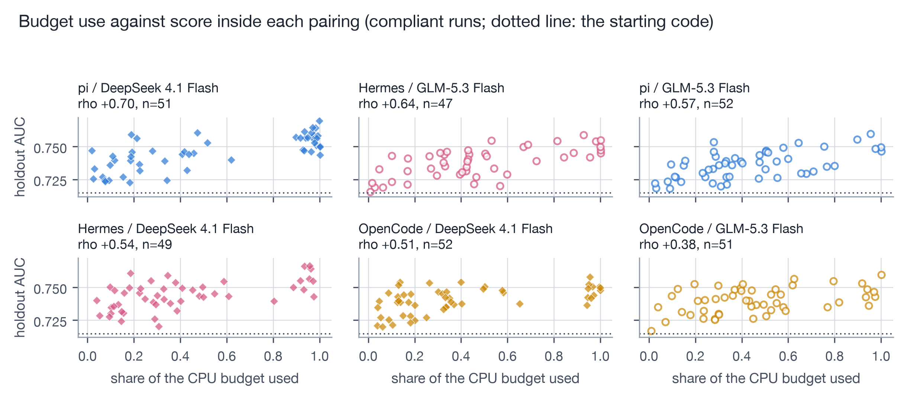
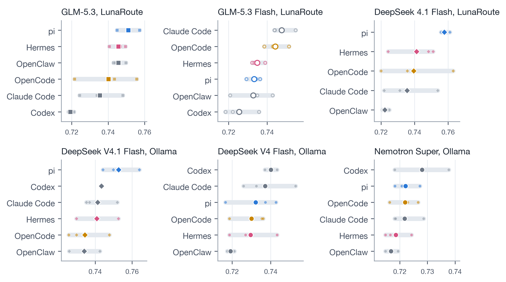

# Introduction

A coding agent is a language model inside a harness: the program that decides what the model sees, which tools it
can call and when the work continues. Teams that adopt one face three questions. Which agent? Which model? And how
many attempts before trusting the result? Many coding-agent evaluations report one or a few attempts per task and
emphasise averages across many tasks. A recent study of harness design runs each of its settings once per task
[@fan2026harness]; HarnessTax runs three attempts per task on 30-task samples and averages them
[@pan2026harnesstax]; MLE-bench's guidance asks for at least three seeds because agents are high-variance
[@chan2024mlebench]. @bjarnason2026randomness have already shown that this is not enough: ten independent runs of
six agent configurations at two temperatures on SWE-bench Verified, 60,000 trajectories in all, moved single-run pass@1 by 2.2 to 6.0
percentage points depending on which run was used, with standard deviations above 1.5 points even at temperature 0.
They recommend estimating pass@1 from several runs per task and choosing the number of runs by power analysis. We take
that lesson as given. Their unit is still a benchmark score, a pass rate over many tasks with each attempt a pass or a
fail. A team running an agent on its own task meets something else: the spread of a continuous measure of what one
task's attempts deliver, and questions a pass rate does not raise. Did the delivered artifact break the task's rules?
Is keeping the best of several attempts worth it? Does the gain hold on data from later?

We study that question by intensive replication on one machine-learning task, because such a task makes an agent's
work scorable without a human grader. The agent is handed a working XGBoost model that predicts whether a US airline
flight will leave at least 15 minutes late, from eight fields such as carrier, route and departure time, and it
edits the training code to make the model predict better. A holdout of one million later flights, which no agent
sees, scores the delivered model by AUC: the chance that the model ranks a late flight above an on-time one. The
score is continuous and has room to rise, each run is cheap to repeat, and breaking the task's data rules leaves
traces in the delivered code.

Three studies use this task. The first is broad: six agents on six open-weight model endpoints, three runs each. The
second is deep: three agents on two models, each pairing run 52 times with the data, prompt, budget, machine type
and parallelism fixed, 312 runs in all. The third makes a planned change of model: the same three agents on a larger
model from the same family, another 156 runs.

Run-to-run variation, harness effects that depend on the model, best-of-k evaluation and rule-breaking by agents
are each established (Section 2); we do not claim to have found them. What we add are measurements a team can act on,
for one task under one protocol: the distribution of artifact quality, observed compliance and the value of
repeat-and-select policies, measured together. The central distinction is between selecting a useful artifact and
ranking configurations. A few attempts, with rule-breaking attempts rejected before the best is chosen, reliably buy a
better artifact; telling configurations apart takes tens of runs of each; and scores on a later year shrink every
gain. Intensive replication also lets us set the variation within a pairing against a planned model substitution and
against exploratory agent-by-model interactions. A separate analysis examines how the deployed pairing affects token
use and caching. We report six results.

1. **One run is a draw.** The median pairing's run-to-run standard deviation over compliant runs, 0.0107 AUC, is
   larger than the 0.0095 spread between the six pairing means. Three-run comparisons put the weaker pairing ahead
   28 to 44 percent of the time, and for the agent differences observed here the usual approximation calls for
   roughly 39 to 113 runs per arm.
2. **Compliance failures sit at the top of the ranking.** Ten of 312 runs trained on the labelled evaluation file or
   computed features from the batch they were scoring, and they include the seven highest scores. Excluding them
   lowers the best score from 0.8293 to 0.7695 and leaves the spread between pairing means almost unchanged.
3. **A few attempts buy a better artifact, not a reliable ranking.** The best compliant artifact among three
   attempts, chosen on the evaluation set, has a median holdout AUC 0.0081 above one attempt (95 percent interval
   0.0063 to 0.0098), and three attempts returned a compliant artifact with an estimated probability of at least
   99.88 percent.
4. **A planned model upgrade is about one run of noise, and its size depends on the agent.** Runs on the larger model
   scored 0.0091 AUC higher, 7.1 standard errors from zero, yet one run of each still favoured the smaller model 28
   percent of the time. pi's gain, 0.0152, exceeded the other two agents' by 2.7 and 3.3 standard errors.
5. **Cost depends on the pairing, largely through the prompt cache.** In a rate-card projection for one observed
   comparison, the same job cost \$0.08 a run through pi and \$1.86 through Claude Code on one endpoint, and most of
   the gap follows the share of input the endpoint served from its cache.
6. **Much of the gain belongs to the year the agents tuned on.** Scored on one million flights from 2007, the same
   artifacts kept a third of their gain over the starting code, the spread between runs halved, and the larger
   model's advantage fell to 0.44 run-to-run standard deviations. Every finding kept its direction, but pi's larger
   gain no longer separated from the other agents'.

Section 2 places these results in prior work. Section 3 describes the task, the agents and the three designs.
Section 4 reports the results by finding rather than by study, and Section 5 discusses what they mean for
evaluating agents, what a difference in AUC is worth, and the limitations.

# Related work

## Harnesses, models and their cost

Agent evaluation has moved from treating the model as the evaluated object to studying the system around it.
SWE-agent showed that an interface designed for the model makes a software-engineering agent more capable than a plain
shell does [@yang2024sweagent]. @lewis2026same held a model and its tasks fixed and changed only how the harness managed context. On 169 SWE-bench
Verified tasks under a tight context window, complete solutions rose from 43 to 72, and the change transferred to
three other models; the paper concludes that "coding-agent evaluations should treat the model and harness together
as the tested solver". @fan2026harness ablate the components of one harness across four open-weight models, running
each setting once per task and comparing settings with paired tests over tasks, and find effects that depend on the
model: planning is "an accuracy scaffold for weaker models" and "a cost saver for stronger models". HarnessTax
[@pan2026harnesstax] pairs seven models with Claude Code, Codex CLI and pi on 30-task samples of SWE-bench Lite and
Terminal-Bench 2.0 [@jimenez2024swebench; @merrill2026terminalbench], averages three attempts per task, and finds
that the harness moves cost far more than success; its strongest pairing solved 97.8 percent of its attempts on the
sampled SWE-bench Lite tasks. HarnessTax emphasises mean cost and success across tasks; our analysis emphasises the
distribution of artifact quality across repeated attempts on a fixed task.

On cost, @kapoor2024agents argue that agents should be compared on cost and accuracy together. @lawrence2026harness
holds the model fixed and routes twelve harness configurations through one gateway. Cache-aware accounting reverses
several of its cost rankings, and it shows that the share of input read from cache is a property of the whole path
from harness through gateway to provider: the one harness speaking the gateway's Anthropic-style dialect, Claude
Code, received almost no cache reads where the others received 56 to 85 percent. Our cache observation (Section 4.9)
is an additional operational case of the same kind, on a different gateway, with a pattern that a dialect
translation failing everywhere would not produce.

## Agents doing machine-learning engineering, and breaking the rules

MLE-bench evaluates agents on 75 Kaggle competitions [@chan2024mlebench]. RE-Bench compares agents with human
experts on seven open-ended ML research-engineering environments and aggregates repeated attempts as best-of-k under
different time budgets [@wijk2025rebench]. DeltaML-Bench asks agents to improve published baselines in 48 research
repositories [@moukpe2026deltaml]. These benchmarks cover far more tasks than ours; we study one task deeply enough
to estimate the distribution of repeated identical attempts. Closest to our setting, @ferreira2026autoresearch use
autoresearch, in which an agent tunes a model by editing its training code under a fixed compute budget, to compare
agents with classical hyperparameter optimisation: editing code narrowed the gap to classical methods without
closing it. On tabular benchmarks, a budget-matched multi-seed comparison found that an LLM advisor added nothing
measurable on held-out data once classical search started from the same default [@rodrigues2026llmhpo]. Whether
agents beat classical search is a different question from ours, which compares agents with each other. The task
continues our earlier study of agent-driven XGBoost tuning on the same data [@pafka2026autoresearch].

Rule-breaking by capable agents is well documented. METR found reward hacking in 7 of 164 attempts on one task suite
in its evaluation of o3, and reports that counting them would have put o3's score well beyond expert performance
[@metr2025o3]. SpecBench finds that the gap between visible and held-out tests in long-horizon coding grows with the
size of the task [@zhao2026specbench], and DeltaML-Bench reports specification-gaming rates as high as 47.9 percent
for one family of agent configurations [@moukpe2026deltaml]. Flaws in a benchmark's task setup or scoring can
misestimate agent performance by up to 100 percent in relative terms, which is why checklists for building agentic
benchmarks now exist [@zhu2025abc]. Closest to our violations, @chen2026publicscore study
machine-learning workflows in which a user watches only the score on a labelled public evaluation file and presses
the agent, round after round, to raise it. They define public score exploitation as raising that score through
shortcuts without improving a hidden private evaluation, mostly by copying the public labels into predictions or
training on them. Across 34 tasks and 13 agents they found 403 exploitative runs; stronger models exploited more,
more pressure brought exploitation earlier, and an explicit instruction not to use the public labels mostly removed
it. Our setting differs in three ways. The prompt was fixed and there was no escalating pressure: each run was one
autonomous session. The rules stated each file's role, training on the training file and evaluating on the
evaluation file, and said the hidden holdout is what matters, but did not add their anti-exploit wording. And one of
the two violations we see, training on the labelled evaluation file, adds labelled data from the holdout's year: in
Study 2 the runs that did it scored 0.7855 to 0.8293 on the hidden holdout, against 0.7695 for the best compliant run. Breaking a task's data rules is therefore not the
same as contaminating the test: no run saw the holdout. We describe what the delivered code did and make no claim
about intent. We report two such violations, training on the labelled evaluation file and computing features from
the batch being scored, measured on a continuous scale on which they occupy the top of the ranking while the scoring
holdout stays secret.

## Variation between identical runs

That repeated trials of a stochastic method differ is an old lesson. In deep reinforcement learning, nondeterminism
and variance intrinsic to the methods made reported improvements hard to interpret [@henderson2018deep], and comparisons resting on a few runs per task
proved unreliable enough that interval estimates and robust aggregates became the recommended practice
[@agarwal2021precipice]. Variance
from data sampling, initialisation and hyperparameter choice changes the outcome of machine-learning benchmark
comparisons [@bouthillier2021variance], and fine-tuning one pretrained model 2,100 times while varying only the
random seed produces substantial differences [@dodge2020finetuning]. Agent evaluation has direct analogues: τ-bench's
pass^k measures whether an agent succeeds consistently across repeated trials [@yao2024taubench], and
@rabanser2026reliability argue that a single success rate hides consistency, robustness and predictability. The
statistics of comparing noisy systems, error bars, paired comparisons and sample-size planning, are set out for
language-model evaluations by @miller2024errorbars, whose approximations we use. For coding agents,
@bjarnason2026randomness measured this variation directly: ten runs of each of six configurations, at two temperatures, on the
500 tasks of SWE-bench Verified, a trace of how runs diverge within the first few percent of tokens, and a power analysis in
which detecting a 2-point gain in pass@1 needs about 9 runs and a 1-point gain about 36. Their recommendations,
several runs per task, power analysis, and pass@k beside pass^k, are the ones we follow. Our design differs in its
outcome and its depth: one task instead of 500, a continuous measure of the delivered artifact instead of pass or
fail, and 52 runs per pairing instead of ten. That depth is what lets us measure the distribution of one task's
outcomes and set compliance, selection among attempts and transfer to a later year against it.

# Methods

## Task and data

The data are the US flight records of the ASA Data Expo 2009 [@dataexpo2009], sliced as in our earlier study
[@pafka2026autoresearch]. The task, the data slices and the starting code come from that study; the repeated-run
experiments, compliance audits, comparisons and analyses here are new. Each row is a flight with eight fields (month, day of month, day of week, departure time,
carrier, origin, destination and distance) and a label: whether it left 15 minutes or more late. The split is fixed
and identical for every run: training on 100,000 flights from 2005, a labelled evaluation set of 100,000 flights from
2006 that the agent may use, and a holdout of 1,000,000 flights from 2006 that no agent sees. Each slice was built
with the two classes in equal numbers. A further 1,000,000 flights from 2007, prepared the same way, serve only the
later-year check of Section 4.7.

The departure time is the time the flight actually left, as in the public benchmark these slices come from; the
task description given to the agents called it the scheduled time. It carries information that a forecast made
before departure would not have. Every agent had the same data and description, so comparisons between runs are
unaffected, but the AUCs here measure improvement on a fixed optimisation benchmark, not how predictable delays are.

On a holdout of 500,000 flights of each class, the standard error of an AUC near the observed 0.74 is 0.00049 by the
formula of @hanley1982meaning, treating the rows as independent draws from the 2006 flights the holdout samples. That
bounds the scoring noise of one run on this holdout; it says nothing about other years, airports or tasks. Flights
share carriers, airports and days, so rows are not truly independent and the figure is a lower bound, while runs
compared on the same holdout are paired, which makes their differences more precise [@delong1988comparing]. The
differences of 0.01 to 0.04 between runs reported below are twenty or more times larger.

The agent receives a working training script (`train.py`) that fits an XGBoost classifier, a run script that trains
and scores one version on the evaluation set, and written task rules. The rules allow any change to `train.py`,
including feature engineering, tuning and early stopping, as long as the script still trains on the training file
and evaluates on the evaluation file. They require encoders and statistics to be fitted on training data only,
"never on the dataframe passed in" for prediction, and they ask the agent to leave its best version as the final
one. The starting code scores 0.7148 AUC and 0.7041 average precision on the holdout.

## Agents, models and endpoints

Six agents took part, at the same versions in every study: Claude Code 2.1.268, Codex CLI 0.153.4, pi 0.85.1,
OpenCode 1.18.30, OpenClaw 2026.9.4 and Hermes at a pinned commit (d20a8e4). The models are open-weight, reached
through two hosted endpoints: GLM-5.3, GLM-5.3 Flash and DeepSeek 4.1 Flash through LunaRoute, and DeepSeek V4.1
Flash, DeepSeek V4 Flash and Nemotron Super through Ollama Cloud. We pinned agent versions and model identifiers;
which upstream build served a model was the endpoint's choice and is not recorded. No run set a reasoning level: the
configuration sends no reasoning-effort field, which on these endpoints selects the model's default, and for both
GLM models that default is the top effort setting. Web search was off by instruction, and containers had no network
access except to the model endpoint.

## Procedure

Each run takes place in its own container with 4 CPU cores, and 8 GB of memory in Study 1 or 6 GB in Studies 2 and
3. The agent works in a git repository holding the starting code and may run 40 counted experiments, each a call to
the run script with a 120-second limit. The scored artifact is the `train.py` the agent leaves at the end, re-run
against the holdout outside the agent's reach. Runs are independent: nothing carries over between them, and in
Studies 2 and 3 the seed number is only a label that nothing in the code reads. The variation between runs is
therefore variation in the deployed agent-model-endpoint system. We did not try to hold the endpoint constant, and
no team using a hosted model can: we pinned agent versions and model names, but the builds, load and routing behind
a hosted model can change at any time, and the variation we report includes whatever changed while the runs were
made. Retraining adds
little to it: re-running a compliant delivered file from scratch reproduced its recorded holdout AUC to within about
0.0002 in the runs we checked, the residue of tree training that is not bit-deterministic.

| | Study 1 | Study 2 | Study 3 |
|:---------|:--------------------------|:--------------------------|:--------------------------|
| Question | does the pairing matter? | how much does one run vary? | what does a larger model buy? |
| Agents | all six | pi, OpenCode, Hermes | pi, OpenCode, Hermes |
| Models | six endpoints | GLM-5.3 Flash, DeepSeek 4.1 Flash | GLM-5.3 (against Study 2's GLM-5.3 Flash) |
| Runs | 3 per pairing; 116 in all, 113 delivered an artifact, 103 scored | 52 per pairing; 312, all scored | 52 per pairing; 156, 152 scored |
| Dates | 13 to 15 September 2026 | 15 to 16 September 2026 | 16 to 17 September 2026 |
| Machines | one container per run | four identical 16-core machines, four runs at a time | four more machines of the same type |

Table: The three studies. Study 2's agents had the three highest averages on the LunaRoute rows of Study 1, which is
how they were chosen; Study 1 could not rank them reliably. Within Studies 2 and 3 every machine ran every pairing,
so machine and pairing are not confounded. Study 3's GLM-5.3 Flash arm is Study 2's runs, made the day before its
GLM-5.3 runs.

## The compute budget

Each run had 18,000 CPU seconds of Python compute, with a container-level stop at 46,000, calibrated by re-running
earlier delivered code on the same hardware. The meter sums user and system CPU time of every Python process the
container starts, including child processes; a hook in the interpreter refuses new processes once the budget is
spent and a watchdog stops one that crosses it. The meter does not count the model's own generation or any reasoning
done in context rather than in code, so budget use measures metered Python CPU work, excluding model inference and
in-context reasoning. Two runs
overshot, by at most 17 seconds; none reached the container stop.

## Compliance and audits

A run is compliant when its delivered code obeys the two data rules that matter for scoring: no evaluation label
reaches a model fit, other than as the early-stopping set the rules permit, and no feature or statistic is computed
from the frame handed to the prediction function. Two traces run over every delivered file, not only suspicious
ones. One follows the evaluation labels to fit calls; the other follows statistics computed on the prediction frame.
Every hit was read, and its verdict is published with the reason, so each call can be checked. Seven hits were cleared on reading.
Four were tracing errors: the flagged data were training rows, or the evaluation rows served only as the
early-stopping set or as the matrix being scored. Of the two cleared frame-statistics hits, one grouped rows only to index them and one fitted a label-taking encoder that never sees a
scored frame. The seventh is borderline: an OpenCode run on GLM-5.3 fitted a classifier to tell evaluation rows from
training rows, on features alone, and used it to weight its training data. No evaluation label reached a fit, so it
counts as compliant under the rule applied here. It scored 38th of its pairing's 50 compliant runs, and excluding it
moves Study 3's gain by 0.0001.

A simpler screen, which flags a run whose best evaluation score exceeds its holdout score by more than 0.03, is
published with the data but not used. It compares a run's best experiment with the program it delivered, which need
not be the same, and on these runs it would have excluded two compliant runs and missed two that trained on
evaluation labels.

A run whose delivered code fails when scored on the holdout is a failed attempt, not a compliant one: four Study 3
runs, none in Study 2. Two Study 3 runs delivered the starting code unchanged; they are compliant and keep its score.

Exclusions differ by design. Study 1 asks which pairing is better, so its quality tables drop the runs that never
started and the two noncompliant runs. Studies 2 and 3 ask what the distribution looks like, so every run is
counted, compliant results are reported separately from all-run results, and the figures plot compliant runs only.
Table 5 shows how the headline numbers move under each exclusion rule.

## Statistics

Standard deviations are sample standard deviations. Means pool a pairing's compliant runs; in Study 3, weighting the
three agents equally instead gives the same means to four decimals. The standard error of a difference between two
means is the square root of the sum of their squared standard errors; a 95 percent interval for a gain is a
bootstrap over runs with 20,000 resamples. Run counts for detecting a difference use the approximation 16 sd² / gap²
per arm, where sd is the run-to-run standard deviation and gap the difference, for 80 percent power in a two-sided
test at the 5 percent level. We apply it to observed contrasts as an illustration; the counts are not general
requirements and do not give the runs a complete ranking would need. For each pair of pairings, we compare the mean AUC of
every possible three-run draw from one with every such draw from the other, sampling with replacement.

**Repeat-and-select policy.** Within a pairing, k attempts are drawn from its observed runs with replacement,
noncompliant and unscorable attempts are rejected, and the compliant attempt whose delivered code scores best on the
evaluation set is kept and scored on the holdout. Let a pairing have n observed attempts, m of them rejected as
noncompliant or unscorable, and rank its compliant attempts r = 1, ..., n − m from lowest to highest evaluation
score, with tied scores sharing their probability equally. With replacement, compliant attempt r is kept with probability ((m+r)/n)^k^ − ((m+r−1)/n)^k^, and no artifact
is returned with probability (m/n)^k^; quality percentiles are conditional on an artifact being returned. The
distribution of the kept score over the observed runs is therefore computed exactly, without simulation, pairings
weighted equally, and the chance of at least one compliant attempt is the pairings' mean of 1 − (m/n)^k^. Those observed runs are themselves a sample, so the 95 percent interval for a gain comes from an outer
bootstrap, resampling each pairing's runs 2,000 times and recomputing the gain; it is conditional on the fixed
evaluation and holdout sets. Yields carry 95 percent Wilson intervals, and the chance that several attempts return a
compliant artifact carries a lower bound from the same outer bootstrap. For comparison, an
oracle chooses on the holdout instead. This analysis is retrospective: the policy was specified after the runs had
been scored, on a holdout hidden from the agents but not from us.

**Interactions.** An interaction contrast is the change in one agent minus the change in another when the model
changes, a difference in differences of four means with a normal-approximation standard error. Its bootstrap
interval resamples runs within each of the four cells and is pointwise. p-values are Holm-adjusted over the three
agent pairs, and a Wald test of no agent-by-model interaction (2 degrees of freedom) tests all three at once.

**Compute.** Budget use and score are compared by rank correlation within pairings, with bootstrap intervals (2,000
resamples) and two-sided permutation tests that shuffle scores inside each pairing.

Table 2 labels each result by how it arose. Where the choice of comparison came after the data, all pairwise
contrasts are shown.

| Result | Data | How it arose |
|:----------------------------------------|:------------------------------|:------------------------------------|
| Spread within against between pairings | Study 2 | planned |
| How often few-run comparisons err | Study 2, every possible draw | planned question, analysed after the runs |
| Rule-breaking in the upper tail | Studies 2 and 3, every run | audited throughout, not a planned comparison |
| Repeat-and-select policy | Study 2 | retrospective |
| Model substitution | Study 3 against Study 2's Flash runs | planned; arms a day apart |
| Agent-by-model interaction | Studies 2 and 3 | exploratory |
| Budget use and score | Studies 1 and 2 | secondary, correlational |
| Cost and caching | Study 1; Study 2's token ledger | observational |
| The same programs on a later year | Studies 2 and 3, on 2007 flights | added after the runs, on unused data |

Table: What each result rests on, and whether it was planned.

## Cost accounting

No metered spend occurred: flat-rate plans paid for every run. Study 1 costs apply Ollama Cloud's published rate
card of 11 September 2026 to the tokens each run reported; Studies 2 and 3 apply OpenRouter's list prices of 16
September 2026. The modelled Study 1 spend tracked Ollama Cloud's own quota meter to within about two percent at two
points in the same week. Claude Code runs that stopped before reporting usage were costed from its request log, which
reproduces the reported cost of every run that has one to within ten cents. Reasoning tokens, which every agent
reports separately from output, were recovered for Study 2 from the agents' own records after the fact.

# Results

## One run is a draw

A single run does not give an agent's average quality. It gives one draw from its distribution. Among compliant runs
of Study 2, the six pairing means span 0.0095 AUC, while the median pairing's standard deviation across its own runs
is 0.0107 (Figure 1, Table 3). Two runs of the same pairing differ by 0.0147 AUC on average over all runs, and by
0.0285 at the ninth decile. Every compliant run beat the starting code, the weakest by only 0.0007; the one run that
scored below it had broken a task rule.

| Agent and model | Compliant runs | Mean | Median | SD | 95% interval of the mean | Best | All-run mean |
|:-----------------------------|----:|-------:|-------:|------:|:-----------------:|------:|------:|
| pi, GLM-5.3 Flash | 52 | 0.7361 | 0.7359 | 0.0104 | 0.7332 – 0.7389 | 0.7597 | 0.7361 |
| Hermes, GLM-5.3 Flash | 47 | 0.7379 | 0.7404 | 0.0112 | 0.7347 – 0.7411 | 0.7590 | 0.7427 |
| OpenCode, GLM-5.3 Flash | 51 | 0.7400 | 0.7402 | 0.0097 | 0.7373 – 0.7427 | 0.7596 | 0.7417 |
| OpenCode, DeepSeek 4.1 Flash | 52 | 0.7403 | 0.7418 | 0.0096 | 0.7377 – 0.7429 | 0.7578 | 0.7403 |
| Hermes, DeepSeek 4.1 Flash | 49 | 0.7441 | 0.7437 | 0.0109 | 0.7411 – 0.7472 | 0.7663 | 0.7459 |
| pi, DeepSeek 4.1 Flash | 51 | 0.7456 | 0.7462 | 0.0125 | 0.7421 – 0.7490 | 0.7695 | 0.7455 |

Table: Study 2, holdout AUC over compliant runs, except the last column.

## Small comparisons cannot rank agents

Study 1 shows what a three-run comparison sees. On four of its six model rows, the gap between the best and worst
agent's three-run average is about the size of the gap between two runs of one agent (Table 4); on the other two, the
gap came from a single agent that spent little of its compute budget. With six agents and no real differences, the
ratio would be about 0.9 by chance.

| Model row | Agent gap | Run-to-run gap | Ratio |
|:--|--:|--:|--:|
| DeepSeek V4 Flash, Ollama | 0.021 | 0.021 | 1.0 |
| DeepSeek V4.1 Flash, Ollama | 0.019 | 0.018 | 1.0 |
| Nemotron Super, Ollama | 0.011 | 0.010 | 1.1 |
| DeepSeek 4.1 Flash, LunaRoute | 0.036 | 0.027 | 1.3 |
| GLM-5.3 Flash, LunaRoute | 0.022 | 0.012 | 1.9 |
| GLM-5.3, LunaRoute | 0.032 | 0.011 | 3.0 |

Table: Study 1, holdout AUC, three runs per agent. The agent gap is the best agent's average minus the worst's; the
run-to-run gap is the median, across a row's agents, of each agent's best run minus its worst.

Study 2 measures how often such a comparison errs. When each pairing contributes three compliant runs and two
pairings on the same model are compared by their averages, the weaker pairing comes out ahead in 28 to 44 percent of
all possible draws. For the observed contrasts, the usual approximation needs about 20 runs of each to detect the
widest gap among the six pairings, 0.0095, which changes agent and model together, and about 66 to detect the widest
gap between two agents on the same model, 0.0053. These gaps were chosen after seeing the data, which flatters them;
a comparison fixed in advance should be sized on the smallest difference that would change a decision.

## Compliance failures sit at the top of the ranking

The agents do not merely jitter; they sometimes take a different approach, and some approaches are not allowed. Five
of the 312 Study 2 runs added the labelled evaluation file to their training data. Four of them were Hermes on
GLM-5.3 Flash, and the five scored 0.7855 to 0.8293. Five other runs computed features from the batch they were
asked to score, and scored 0.7116 to 0.8036. No run did both. The seven highest scores in the study are all among
these ten, and removing them takes the best score from 0.8293 to 0.7695. The share of noncompliant runs ranged from
none of 52 to 5 of 52 across pairings.

These are violations of the task's data and prediction rules, not contamination of the hidden test. No run read the
holdout, and every score comes from re-running the delivered code against it. A run that trained on the evaluation
file had more labelled data than the rules allow, from the same year as the holdout, so its score may reflect a real
gain from unauthorised data. A run that computes features from the scoring batch makes each prediction depend on the
other rows in the batch, which the task forbids.

The central comparisons do not depend on the exclusion rule (Table 5). Excluding nothing, either kind of violation,
or both leaves the spread between pairing means and the best-of-k medians almost unchanged. What the violations
change is the tails: the best score, and the median run-to-run standard deviation, which falls from 0.0133 to 0.0107
when they are removed.

| Rule | Runs | Spread of pairing means | Median SD | Best | Best of 3, median | Best of 10, median |
|:--------------------------------|----:|--------:|-------:|------:|--------:|--------:|
| Exclude nothing | 312 | 0.0098 | 0.0133 | 0.8293 | 0.7499 | 0.7565 |
| Exclude evaluation-label training | 307 | 0.0098 | 0.0111 | 0.8036 | 0.7493 | 0.7548 |
| Exclude batch features | 307 | 0.0095 | 0.0117 | 0.8293 | 0.7498 | 0.7564 |
| Exclude both (the paper's rule) | 302 | 0.0095 | 0.0107 | 0.7695 | 0.7493 | 0.7548 |

Table: Study 2 headline numbers under four exclusion rules. No run broke both rules, so each single exclusion removes
five runs. The best-of-k columns use the policy of Section 4.4, rejecting the runs the rule excludes.

Selection is where the violations matter. Because they sit at the top of the ranking, the run one would pick on score
alone is the run most likely to have broken a rule. Two traces find them after the fact, but prevention is better:
putting evaluation labels behind a scoring interface makes unauthorised training impossible, and testing whether a
row's prediction changes when the batch around it changes catches batch-dependent features without reading code.

## What several attempts buy

Attempting a job several times and keeping the best compliant result is a policy, and its value can be measured
(Table 6). The policy chooses among compliant attempts on the evaluation set, which the agents used, and reports the
holdout score of the one it keeps. Three attempts move the median delivered model 0.0081 AUC above one attempt, and
ten attempts 0.0136. Returns fall away quickly, and the floor rises faster than the ceiling: from one attempt to ten,
the 5th percentile improves by 0.0240 and the 95th by 0.0076. Attempts mostly buy protection against a bad draw.

| Attempts | At least one compliant | Median kept | 5th percentile | 95th percentile | Gain over one attempt (95% interval) |
|:--|--:|--:|--:|--:|:--|
| 1 | 96.8% (94.2 to 98.2) | 0.7412 | 0.7220 | 0.7587 | |
| 3 | at least 99.88% | 0.7493 | 0.7355 | 0.7641 | +0.0081 (+0.0063 to +0.0098) |
| 5 | at least 99.99% | 0.7526 | 0.7409 | 0.7645 | +0.0114 (+0.0085 to +0.0131) |
| 10 | at least 99.99% | 0.7548 | 0.7460 | 0.7663 | +0.0136 (+0.0113 to +0.0154) |

Table: The best compliant artifact among k attempts, Study 2, holdout AUC, computed exactly over the observed runs
with the six pairings weighted equally. The first column gives the chance of at least one compliant attempt: for one
attempt the observed rate with its 95 percent interval, for more the 95 percent lower bound. The percentiles describe
the artifact the policy returns, not uncertainty about its median; the last column gives that uncertainty for the
gain in the median. Table 17 gives the same policy for each pairing.

An oracle that chose on the holdout itself would have kept the same medians: selection on the evaluation score
achieved nearly the same holdout performance as oracle selection, with a mean difference of at most 0.00005 AUC. The
holdout's scoring noise, 0.00049, is about twenty times smaller than the spread between runs, so there is little for
the oracle to exploit, and a run's evaluation and holdout scores rank the runs of a pairing almost identically (rank
correlation +0.99 in Study 2, +0.98 in Study 3). This compares two selection policies. It is not an estimate of how far a holdout-selected
winner's score overstates its true performance, the selection bias that motivates nested evaluation and reusable
holdouts [@cawley2010overfitting; @dwork2015generalization; @dwork2015reusable] and that has been found small in
large competitions [@roelofs2019meta].

Repeated sampling has raised the chance of a working program since the first code models [@chen2021codex], and
best-of-k is an established evaluation policy for ML agents [@wijk2025rebench]. Here the candidates must first pass
the compliance check, and their quality is continuous. The distinction here is between the
few attempts that are useful for finding one good artifact and the many runs needed to estimate a small difference
between two pairings. Note also what k counts: attempts, not compliant attempts. A policy that continues until it has
three compliant artifacts costs more and never fails to deliver; the one measured here stops at three attempts.

## A planned model upgrade is about one run of noise

Study 3 ran the same three agents on GLM-5.3, 52 runs each, and compared them with Study 2's GLM-5.3 Flash runs:
two deployed configurations, a day apart, as a team switching models would see them. Over the three agents'
compliant runs, GLM-5.3 scored 0.0091 AUC higher, with a
95 percent interval of 0.0066 to 0.0115 (Table 7), 7.1 standard errors from zero. That is 0.87 times the run-to-run
standard deviation of a single pairing. Run each model once and compare, and the smaller model still comes out ahead
28 percent of the time: 15 percent with pi, 33 with Hermes, 35 with OpenCode (Figure 2). This is a standardised
effect size, not a new metric; the point is what it means for someone who runs each option once.

| Agent | GLM-5.3 | Runs | GLM-5.3 Flash | Runs | Gain | 95% interval |
|:---------|-------:|----:|-------:|----:|-------:|:---------------:|
| pi | 0.7513 | 47 | 0.7361 | 52 | +0.0152 | +0.0110 – +0.0193 |
| Hermes | 0.7446 | 47 | 0.7379 | 47 | +0.0067 | +0.0021 – +0.0113 |
| OpenCode | 0.7455 | 50 | 0.7400 | 51 | +0.0055 | +0.0016 – +0.0094 |
| **All three** | **0.7471** | 144 | **0.7380** | 150 | **+0.0091** | +0.0066 – +0.0115 |

Table: Study 3, holdout AUC over compliant runs, under the same rules for both models.

Quality among compliant runs is one outcome; how often an attempt yields a compliant artifact is another. The larger
model yielded one in 144 of its 156 runs, against 150 of 156 for Flash (Table 8). Twelve failures against six are too
few to call the larger model less reliable (Fisher's exact test, p = 0.22; 95 percent intervals 87.0 to 95.5 and
91.9 to 98.2 percent), but they belong beside the gain. Under the three-attempt policy of Section 4.4, both models
return an artifact with an estimated probability of at least 99.6 percent, and the larger model's median artifact is
0.0091 higher.

| Model | Runs | Compliant | Yield | Compliant mean | One attempt, median | Three attempts, delivered | Three attempts, median |
|:--|--:|--:|--:|--:|--:|--:|--:|
| GLM-5.3 Flash | 156 | 150 | 96.2% | 0.7380 | 0.7385 | at least 99.76% | 0.7473 |
| GLM-5.3 | 156 | 144 | 92.3% | 0.7471 | 0.7482 | at least 99.67% | 0.7564 |

Table: Study 3 as a deployment sees it: yield, quality and the repeat-and-select policy of Table 6, three agents
weighted equally. Yield counts runs whose code could not be scored as failures. Three attempts, delivered: the 95
percent lower bound on the chance that at least one is compliant.

The result also answers a fair question about Studies 1 and 2. When a benchmark reports that agents do not separate,
a reader should ask whether it can detect anything at all. It can: one planned change moved the score by seven
standard errors on the design that could not rank three agents. The two arms ran on consecutive days, the Flash
runs on 15 and 16 September and the GLM-5.3 runs on 16 and 17 September, through the same gateway, so the gain
includes whatever changed at the endpoint in between. Scores did not drift within an arm: the first and second halves
of the GLM-5.3 arm average the same to four decimals. And Study 1, which ran both models on 13 September with their
runs overlapping in time, found a gain of similar size for the same three agents, +0.0075 from eight and nine runs
(1.7 standard errors). A shift at the endpoint between days is therefore an unlikely explanation for the gain,
though not one we can exclude.

Table 9 puts the effects on one scale. Each row is a different question; the last three need very different numbers of runs.

| Question | Effect | In run-to-run SDs | Runs per arm |
|:------------------------------------------------|-------:|-----:|----:|
| Did the agent improve on the starting code? | +0.0277 | 2.7 | — |
| Did the larger model improve the pairing? | +0.0091 | 0.9 | 21 |
| Are two agents different on GLM-5.3? | +0.0067 | 0.6 | 39 |
| Are two agents different on GLM-5.3 Flash? | +0.0039 | 0.4 | 113 |

Table: Observed effects against the median within-pairing SD of GLM-5.3 Flash, 0.0104, and the runs each would need
under the approximation of Section 3.6. The agent rows use the widest gap observed on each model. The first row
compares against a fixed number rather than a second noisy arm, so the two-arm approximation does not apply to it
and no count is given.

Improvement over the starting code was much larger than the differences between configurations. For these observed
contrasts, the model change needs about 21, and
telling two agents apart on one model needs roughly 39 to 113.

## Which agent looks best depends on the model

The upgrade was not worth the same in every agent. pi gained 0.0152, Hermes 0.0067 and OpenCode 0.0055 (Table 10).
pi's gain exceeds OpenCode's by 0.0097, 3.3 standard errors, and Hermes's by 0.0085, 2.7 standard errors; both
remain below 0.05 after Holm adjustment for the three pairs, and a joint test rejects no interaction (χ² = 12.3 on 2
degrees of freedom, p = 0.002). Hermes and OpenCode cannot be told apart. The same planned model change, on the same
task under the same budget, was worth more than twice as much in one agent as in either of the others. This agrees
with @lewis2026same and @fan2026harness, who find harness effects that depend on the model; here the interaction is
measured against the spread of repeated runs. On a later year the pattern keeps its direction but no longer clears
(Section 4.7).

Study 2 shows the same ordering (Figure 3). Moving from GLM-5.3 Flash to DeepSeek 4.1 Flash raised pi by 0.0095,
Hermes by 0.0062 and OpenCode by 0.0003, and the agents' order reverses between the two models: OpenCode is highest
on GLM-5.3 Flash and pi on DeepSeek 4.1 Flash. Two cautions apply. The pattern was noticed after the data were in,
across two models from different families, so it is a pattern to test rather than a finding. And the two studies are
less independent than they look: both start from the same GLM-5.3 Flash runs, on which pi trails OpenCode by 0.0039,
and that gap counts toward pi's larger gain in both. The part the studies contribute separately is that pi leads
OpenCode on each stronger model, by 0.0053 on DeepSeek 4.1 Flash and 0.0058 on GLM-5.3, at 2.4 and 2.6 standard
errors (Figure 4).

| Study: model change | Contrast | Estimate | SE | In SEs | Pointwise 95% interval | Holm p |
|:------------------------|:---------------------|-------:|------:|-----:|:----------------------|-----:|
| 2: to DeepSeek 4.1 Flash | pi vs Hermes | +0.0033 | 0.0032 | 1.0 | −0.0029 to +0.0094 | 0.30 |
| | pi vs OpenCode | +0.0092 | 0.0030 | 3.1 | +0.0034 to +0.0150 | 0.006 |
| | Hermes vs OpenCode | +0.0059 | 0.0030 | 2.0 | +0.0002 to +0.0116 | 0.095 |
| 3: to GLM-5.3 | pi vs Hermes | +0.0085 | 0.0032 | 2.7 | +0.0024 to +0.0148 | 0.015 |
| | pi vs OpenCode | +0.0097 | 0.0029 | 3.3 | +0.0040 to +0.0155 | 0.003 |
| | Hermes vs OpenCode | +0.0012 | 0.0031 | 0.4 | −0.0049 to +0.0072 | 0.71 |

Table: Interaction contrasts: the change in one agent minus the change in another when the model changes from
GLM-5.3 Flash, compliant runs. All three pairs are shown for each study; the choice of pair is exploratory in both.
Joint tests of no interaction: χ² = 10.2, p = 0.006 (Study 2); χ² = 12.3, p = 0.002 (Study 3).

The pale bands in Figures 3 and 4 separate the two kinds of spread this paper is about. Every Study 2 mean lies
inside every pairing's middle 80 percent of runs, and even pi's two Study 3 bands overlap across their middle,
although pi's gain is 7.1 standard errors from zero in the means. The means are precise; a comparison of single runs
is unreliable.

## A later year keeps a third of the gain

Every score so far comes from a holdout drawn from 2006, the year of the evaluation set the agents tuned on. To see
how much of what they delivered carries forward, we retrained all 464 scored programs of Studies 2 and 3 exactly as
the scorer does and applied each to one million flights from 2007, prepared the same way and used by no earlier
analysis (Table 11). The same fits reproduced the recorded 2006 scores (median difference 0.0002 among compliant runs), and the
starting code scores 0.7175 on 2007, slightly above its 0.7148 on 2006, so it did not score worse on the later-year data.

| | 2006 holdout | 2007 flights |
|:----------------------------------------------------|---------------:|---------------:|
| Gain over the starting code, 446 compliant runs | +0.0280 | +0.0092 |
| Compliant runs below the starting code | 0 | 33 |
| Spread of the six Study 2 pairing means | 0.0095 | 0.0021 |
| Median run-to-run SD, Study 2 | 0.0107 | 0.0060 |
| Best of three attempts over one | +0.0081 | +0.0022 |
| Larger model's gain | +0.0091 (7.1 SE) | +0.0027 (3.8 SE) |
| pi's gain minus OpenCode's | +0.0097 (3.3 SE) | +0.0023 (1.3 SE) |
| Rule-breakers among the ten highest, Studies 2 and 3 | 7 and 6 | 7 and 6 |

Table: The same delivered programs on the 2006 holdout and on 2007 flights. The policy is that of Table 6, chosen on
the evaluation set as before; its 2007 gain has a 95 percent interval of +0.0010 to +0.0032.

A third of the agents' gain survives. The rest was specific to 2006, the year both the evaluation set and the holdout
come from, and a run's two scores are only loosely related: inside a pairing their rank correlation is +0.38. Every
finding keeps its direction on 2007 but shrinks. Runs of one pairing still vary more than the pairings differ, now
0.0060 against 0.0021. The rule-breaking runs still hold the top of the ranking, and those that trained on the
evaluation labels stay well above the compliant runs, consistent with a real gain from more recent data. Three
attempts still buy a better artifact, by about a quarter as much. The larger model's gain remains detectable but
falls to 0.44 run-to-run SDs, about 82 runs per arm under the approximation of Section 3.6, and pi's larger share of it
no longer separates from the other agents'.

The sizes in this paper therefore describe the year the agents tuned on. That is what a team measures when it
validates on the period it selected on, and it is why confirming a chosen model on later, untouched data matters
more than any single number here. We did not test why the gain shrinks.

## Budget use predicts score inside a pairing

Runs that spent more of their measured compute scored higher (Figure 5). In Study 1 the rank correlation between
budget use and score is +0.59 over 103 runs, where it could mean that some agents simply work harder than others.
Study 2 holds the agent and model fixed: within pairings the correlation is +0.55 over 312 runs (95 percent interval
+0.45 to +0.63), the same over compliant runs, and positive in every pairing, from +0.38 to +0.70. The association
is correlational: it does not show that forcing a run to use more CPU would improve it, and an agent whose search is
going well may simply continue.

Low budget use is not a sign of giving up. Every one of the 95 runs that used under a quarter of the budget ran all 40
counted experiments; they used cheaper methods. The association weakens among high-budget runs (+0.43 above a
quarter of the budget, +0.29 above half, +0.12 above three quarters with an interval spanning zero), though
narrowing the sample also narrows the predictor, so this is not by itself evidence of diminishing returns (Table 16).

## Cost follows the pairing, mostly through the cache

In Study 1, on DeepSeek V4 Flash through Ollama Cloud, the same job cost \$0.08 a run through pi and \$1.86 through
Claude Code at rate-card prices (Table 12). This 23-fold figure is a rate-card projection for one observed
comparison, not a general multiplier for either agent. The endpoint served 92 to 98 percent of pi's and Codex's input
from its prompt cache, and 2 to 11 percent of Claude Code's. Repricing Claude Code's own token volume at pi's cache
share gives \$0.20 a run: as an accounting counterfactual, the cache accounts for about ninefold of the gap and
Claude Code's larger token volume for the rest. The counterfactual does not explain why the cache failed.

| Agent | Run 1 | Run 2 | Run 3 | Mean cost |
|:-------------|-------------:|-------------:|-------------:|-----------:|
| pi | 98%, \$0.08 | 98%, \$0.11 | 97%, \$0.05 | \$0.08 |
| OpenClaw | no record | 98%, \$0.11 | 97%, \$0.07 | \$0.09 |
| Codex | 96%, \$0.14 | 96%, \$0.19 | 92%, \$0.13 | \$0.15 |
| OpenCode | 80%, \$0.24 | 64%, \$0.19 | 66%, \$0.49 | \$0.31 |
| Hermes | 56%, \$1.09 | 89%, \$0.47 | 74%, \$0.24 | \$0.60 |
| Claude Code | 11%, \$1.41 | 9%, \$2.95 | 2%, \$1.21 | \$1.86 |

Table: Study 1, cached share of input and rate-card cost per run, DeepSeek V4 Flash, Ollama Cloud.

The cache failure belonged to the pairing, not to either half. Claude Code cached 96 to 97 percent of its input on
DeepSeek V4.1 Flash and 73 to 84 percent on Nemotron Super, and every agent on those two models cached 70 to 99
percent. It failed again on one more model, DeepSeek V4 Pro, whose row the quota stopped after eight runs: Claude
Code cached 4 and 11 percent while the other five agents cached 83 to 99. The quota cut off both Claude Code runs,
but also both of pi's, which still cached 91 and 98 percent. On V4 Flash, Claude Code's request log shows the cache
returning almost nothing from the first request, at 14,000 tokens, while on V4.1 Flash the same agent reads its
prompt back at up to 122,000 tokens, so context size does not explain it.

@lawrence2026harness observed the same agent's cache share collapse through another gateway and traced it to the
gateway's translation of Claude Code's Anthropic-style request format. Claude Code reached Ollama Cloud through the
same kind of endpoint, so our case is consistent with his conclusion that cache share belongs to the whole path from
agent through gateway to provider. It is not consistent with a translation that fails for every model: through the
same endpoint, Claude Code cached normally on V4.1 Flash and Nemotron Super. Whatever failed depends on the model
behind the endpoint as well. We have not tested the mechanism. Cost also moved between identical runs: Hermes cost
\$0.24, \$0.47 and \$1.09 for the same work, a 4.6-fold swing, and across the 25 Study 1 pairings with three complete
costs the median swing was 2.2-fold.

Table 13 sets the nine configurations of Studies 2 and 3 side by side: their token use, list-price cost, yield,
quality and the three-attempt policy. Within a model, the costliest agent spent 1.2 to 2.1 times what the cheapest
did per run, and the order by cost did not follow the order by quality: Hermes read the most input on every model
without delivering the best artifacts. Moving from GLM-5.3 Flash to GLM-5.3 raised list-price cost about fifteenfold
for 0.0091 AUC. These costs apply no cache discount, which Study 1 shows can reorder agents, and exclude reasoning
tokens; over Study 2's runs, reasoning was about a third of all generated tokens, 8.7 of 25.1 million.

| Agent, model | Input tokens per run | Output tokens per run | List-price cost per run | Yield | Compliant mean | Best of 3, median |
|:-----------------------------|------:|------:|------:|------:|------:|------:|
| pi, GLM-5.3 Flash | 4.34M | 58k | \$0.45 | 100% | 0.7361 | 0.7460 |
| Hermes, GLM-5.3 Flash | 8.12M | 68k | \$0.83 | 90.4% | 0.7379 | 0.7461 |
| OpenCode, GLM-5.3 Flash | 5.70M | 32k | \$0.58 | 98.1% | 0.7400 | 0.7486 |
| pi, DeepSeek 4.1 Flash | 3.93M | 63k | \$0.63 | 98.1% | 0.7456 | 0.7567 |
| Hermes, DeepSeek 4.1 Flash | 8.65M | 69k | \$1.34 | 94.2% | 0.7441 | 0.7535 |
| OpenCode, DeepSeek 4.1 Flash | 5.07M | 26k | \$0.78 | 100% | 0.7403 | 0.7488 |
| pi, GLM-5.3 | 5.87M | 91k | \$8.61 | 90.4% | 0.7513 | 0.7594 |
| Hermes, GLM-5.3 | 7.43M | 62k | \$10.67 | 90.4% | 0.7446 | 0.7537 |
| OpenCode, GLM-5.3 | 6.40M | 38k | \$9.13 | 96.2% | 0.7455 | 0.7563 |

Table: The observed configurations of Studies 2 and 3, per run. Costs apply OpenRouter list prices of 16 September
2026 with no cache discount and exclude reasoning tokens; they compare configurations and are not bills. Yield is the
share of 52 runs that were compliant and scored. Appendix D reprices Study 2's token ledger at other models' prices.

# Discussion

## What this means for evaluating agents

The first implication is the unit. Neither the agent nor the model predicted how a combination would score or what
it would cost: the ranking of agents reversed between models, a planned model upgrade was worth more than twice as
much in one agent as in the others, and a prompt cache that worked for an agent on one model failed on another. This
matches the conclusion @lewis2026same draws from harness interventions. An evaluation should name the pairing it
tested.

The second is the number of runs. Table 9 shows how much the answer depends on the question. The gain over the
starting code was far larger than any other contrast, while detecting this model upgrade needs about 21 runs of
each and telling apart the agents observed here on one model roughly 39 to 113. Few repetitions can reveal large operational differences, as Study 1's
cache failure shows, but they were insufficient to characterise within-task variability or to resolve reliably the
small agent differences observed here. That is ordinary power analysis [@miller2024errorbars]; the measured
run-to-run spread is what sets the numbers. The sizes themselves are those of the year the agents tuned on: on a
later year the gains shrank by two thirds (Section 4.7). Designs with many tasks and few attempts per task answer a different
question, how a pairing does across a task distribution, and this study does not speak to their adequacy for it.

The third is the difference between choosing and ranking. A few attempts buy a better artifact cheaply: at the token
prices of this study, roughly \$2 for three attempts and \$8 for ten, before the audit work. Ranking two vendors on
this task would take tens of runs of each. And because the highest scores are disproportionately noncompliant, every
selection policy needs an audit before the ranking, not after it.

## What a difference is worth

An AUC gap should not be converted into money. AUC summarises ranking across every threshold, so it does not say what
changes at the one threshold a team uses. Precision-recall behaviour, unlike ROC, changes with the ratio of positives
to negatives [@saito2015precision], and decision curve analysis evaluates a model by its net benefit at the
thresholds a decision-maker might use, each encoding the relative harm of false positives and false negatives
[@vickers2006decision]. Score the candidates on held-back data, apply the decision rule you run, and count the
outcomes at your own prevalence and costs. Table 14 does this for two of our models, the best compliant run of a
pairing and its median run (0.7695 and 0.7471 AUC), for a team that sees one million cases a month, one in a hundred
of them positive, with a false alarm costing \$10 and a miss \$100, assuming only the prevalence differs from the
benchmark.

| Cases reviewed each month | Caught by the 0.7695 model | Caught by the 0.7471 model | Difference |
|:----------|-------:|-------:|-------:|
| 5,000 | 562 | 580 | −\$1,920 |
| 20,000 | 1,351 | 1,279 | \$7,955 |
| 100,000 | 3,714 | 3,421 | \$32,156 |

Table: Illustrative, not a forecast. Both models were selected and scored on the same holdout, so these are not
validated savings. The better model by AUC is worse at the tightest capacity.

The crossing is the point. Rank candidates on the objective you will use, on a selection set, and measure the chosen
one on untouched data. Average precision needs the same care: for fixed score distributions within each class,
precision, and with it the precision-recall curve and AP, changes with prevalence [@saito2015precision]. Our holdout
was built with the classes in equal numbers while real delays are far rarer, so our AP values compare runs fairly
here and are not the precision a deployment would see.

## Relation to prior work

Run-to-run variation, harness effects that depend on the model, best-of-k evaluation and rule-breaking by agents
are each established (Section 2). @bjarnason2026randomness already showed that single runs of coding agents mislead
and that the number of runs should come from a power analysis; our run counts agree with theirs in kind.
@chen2026publicscore already showed that agents exploit labelled evaluation data, and that the exploitation need not
help on hidden data. What this design adds is their joint measurement on one task under one protocol, on a continuous
measure of the delivered artifact, with enough repetitions per pairing to express a planned model upgrade, an
agent-by-model interaction and the value of a repeat-and-select policy in units of the run-to-run spread. It separates
two uses of repeated attempts that are easily confused: selecting an artifact, which a few attempts do well once
compliance is checked first, and ranking configurations, which takes tens of runs. Compliance is reported as an
outcome beside quality rather than as data cleaning, and the later year shows how much of each gain the tuning year
overstated.

## Limitations

**One task.** Everything here comes from one tabular prediction task with one dataset. The phenomena are likely to
appear elsewhere; their sizes may not. Benchmarks with many tasks and pass/fail outcomes estimate how results
generalise across tasks; ours estimates variation within one configuration and small effects on one task. Neither
replaces the other.

**Exploratory interaction.** Study 2's agent-by-model pattern was noticed after the data were in, and which agent pair
to compare in Study 3 was not planned; the Holm adjustment and joint test cover the three pairs within each study,
not the choice to look. The two studies share their GLM-5.3 Flash runs, so they are not independent confirmations. A
replication specified in advance, on another model family, would test whether the pattern generalises.

**Hosted endpoints change.** We measured systems as deployed, through hosted endpoints whose builds, load and routing
we did not pin and could not have held constant. That variation is part of what we report, as it would be for anyone
using the same services. It matters most for Study 3, whose arms ran on consecutive days, so its gain includes any
change at the endpoint between them; the same-day comparison in Study 1 points the same way.

**The year the agents tuned on.** The evaluation set and the holdout both come from 2006, so the headline sizes
include what is specific to that year. Section 4.7 shows how much of each survives on 2007 flights.

**A retrospective policy analysis.** The repeat-and-select policy was specified after the runs had been scored. The
holdout that scores it was hidden from the agents, but it had informed our earlier analyses, so the policy result has
the standing of a retrospective evaluation rather than a locked, prospective one.

**The task's features.** The departure-time field records when the flight actually left. That does not affect the
comparisons, but the AUCs are not those of a forecast made before departure.

**Selected agents and endpoints.** Study 2's three agents were the highest-scoring in Study 1's LunaRoute rows. The
endpoints are two hosted services, and the same model name can behave differently across providers.

**What the meters see.** The compute meter excludes the model's generation and in-context reasoning. Costs are
rate-card projections, not invoices, and the reasoning setting was left at each endpoint's default, which for the GLM
models is the maximum. Early stopping on the evaluation set was permitted, which makes each run's reported evaluation
score optimistic.

**Compliance is decided by traces and reading.** The traces look for the two violations we anticipated or found,
and every hit was read, but a violation of a kind no trace looks for would pass. One compliant run is a
judgment call (Section 3.5), and it does not move any result.

## Future work

A replication of the agent-by-model interaction specified in advance, on a different model family, would show
whether pi's larger gains generalise. Sending byte-identical prompts to one endpoint in both request formats, the
Anthropic-style one Claude Code uses and the OpenAI-style one the other agents use, would test whether the mechanism
@lawrence2026harness found explains our cache failure, and why it appears on some models only. Re-scoring a sample of
delivered artifacts many times would bound the retraining component of the spread more tightly than our spot checks.
A broader question is how context management interacts with caching: strategies that rewrite or summarise earlier
context, which @fan2026harness find the most efficient when tokens are priced at list rates, also change the prompt
prefix a cache depends on, and could rank differently once cached input is priced as it is billed.

# Conclusion

For this fixed ML-engineering task and these deployed configurations, repeated attempts revealed substantial
variation in outcome, compliance failures distorted the upper tail, and a small number of attempts, with compliance
checked first, supported useful artifact selection even where precise comparisons between configurations required substantially more evidence. A
planned model upgrade was worth about one run of noise, and a different amount in each agent; on a later year the
delivered models kept a third of their gain; cost depended on whether the prompt cache worked for that pairing. Few repetitions can reveal large operational differences, but they
were insufficient to characterise the variation within a task or to resolve the small agent differences observed
here. For teams deploying agents on tasks like this one:

- **Evaluate the pairing, not the parts,** and record whether attempts started and completed, not only how finished
  ones scored.
- **Attempt the job several times.** The best compliant artifact among three attempts had a median 0.008 AUC above a
  single attempt; ten attempts added little beyond three.
- **Reject first, then rank.** Check every attempt against your rules before comparing scores, and where possible
  make violations impossible rather than detectable.
- **Rank on your objective, then confirm on later, untouched data,** and read the leader's code. Here a later year
  kept a third of the gain the tuning year showed.
- **Instrument what nobody looks at:** the cached share of input and the compute used on every run.
- **Price the winner with its predictions,** at your prevalence and costs, and price the failures too.
- **Test again when anything changes:** the model, the agent version, the endpoint, the cache or the price.

# References {.unnumbered}

::: {#refs}
:::

\clearpage
\appendix

# Study 1 in detail

| Model rows | Scheduled | Started | Delivered an artifact | Compliant |
|:--|--:|--:|--:|--:|
| Five complete rows | 90 | 90 | 90 | 88 |
| DeepSeek 4.1 Flash, LunaRoute | 18 | 15 | 15 | 15 |
| DeepSeek V4 Pro, Ollama (partial) | 8 | 8 | 8 | not assessed |

Table: Study 1 run flow: 116 runs, 113 of which delivered an artifact. Three Codex runs never started because the
gateway rejected the request format, leaving the starting code in place; that failure is a property of the pairing
and stays in the table. The V4 Pro row was stopped at 85 percent of a weekly quota, four of its runs cut off mid-run,
and appears only in the cost analysis.

Study 1's quality tables exclude five of the 108 runs on its complete rows: the three that never started, one that
concatenated the evaluation rows into its training data, and one whose delivered code computed count features on the
data being scored, leaving 103. For two agents chosen in advance, the three-run design separates a difference of
about 0.02 AUC.

# The compute budget in detail

The meter covers every Python process started inside the container: experiments run through the provided script, the
agent's own scripts, one-line commands, data loading and feature engineering. A start-up hook records each process
on exit, and every model fit is logged separately with its row count and duration. The budget was calibrated by
re-running earlier delivered code on the same hardware. Counting fits instead of CPU seconds predicts score far more
weakly: +0.25 over Study 1's runs and +0.09 within Study 2's pairings. The number of fits says little; the compute
they consume says more.

# Statistical details

## Compute against score

| Subset | Runs | Rank correlation | 95% interval | p |
|:------------------------------------|-----:|------:|:---------------|----------:|
| All runs | 312 | +0.55 | +0.45 to +0.63 | below 0.001 |
| Compliant runs | 302 | +0.55 | +0.46 to +0.63 | below 0.001 |
| Compliant, above a quarter of budget | 209 | +0.43 | +0.29 to +0.54 | below 0.001 |
| Compliant, above half | 110 | +0.29 | +0.10 to +0.45 | 0.001 |
| Compliant, above three quarters | 70 | +0.12 | −0.15 to +0.41 | 0.342 |

Table: Study 2, rank correlation between budget use and score, with runs ranked inside their own pairing and then
pooled. Intervals are bootstrap over runs with 2,000 resamples; p-values are two-sided, from permutation within
pairings. Study 1: +0.59 over 103 runs, interval +0.45 to +0.71.

## Best-of-k for each pairing

| Pairing | 1 attempt | 3 | 5 | 10 | Gain, 1 to 3 | Gain, 1 to 10 |
|:-----------------------------|-------:|-------:|-------:|-------:|-------:|-------:|
| pi, GLM-5.3 Flash | 0.7359 | 0.7460 | 0.7493 | 0.7529 | +0.0101 | +0.0170 |
| Hermes, GLM-5.3 Flash | 0.7404 | 0.7461 | 0.7499 | 0.7543 | +0.0057 | +0.0139 |
| OpenCode, GLM-5.3 Flash | 0.7402 | 0.7486 | 0.7518 | 0.7532 | +0.0084 | +0.0130 |
| OpenCode, DeepSeek 4.1 Flash | 0.7418 | 0.7488 | 0.7506 | 0.7533 | +0.0070 | +0.0115 |
| Hermes, DeepSeek 4.1 Flash | 0.7437 | 0.7535 | 0.7550 | 0.7607 | +0.0098 | +0.0170 |
| pi, DeepSeek 4.1 Flash | 0.7462 | 0.7567 | 0.7590 | 0.7613 | +0.0105 | +0.0151 |

Table: Median kept holdout AUC under the policy of Table 6 within each Study 2 pairing, computed exactly over the
observed runs. An oracle
choosing on the holdout would raise the mean kept score by at most 0.00013 in any pairing.

# Money, tokens and audits

**Repricing the ledger.** The 312 Study 2 runs read 1.86 billion input tokens and wrote 25.1 million, a ratio of
about 74 to 1, because the agent re-reads a growing transcript at every step. Table 18 reprices that ledger at other
models' prices. It is a sensitivity calculation on one transcript: another model would produce a different transcript
length, completion rate and caching profile, so the table does not say what those models would cost to do the task.

| Model | Price per M tokens, in / out | Repriced ledger | If 90 percent of input were cached |
|:--------------------------------|:------------------|--------:|--------:|
| GLM-5.3 Flash and DeepSeek 4.1 Flash, as run | \$0.10 / \$0.33 and \$0.15 / \$0.60 | \$244 | \$54 |
| GLM-5.3 | \$1.40 / \$4.40 | \$2,717 | \$807 |
| Gemini 3.1 Pro | \$2.00 / \$12.00 | \$4,026 | \$1,009 |
| Kimi K3 | \$2.65 / \$13.28 | \$5,265 | \$1,334 |
| Claude Opus 5 | \$5.00 / \$25.00 | \$9,939 | \$2,397 |
| GPT-5.5 Pro | \$30.00 / \$180.00 | \$60,385 | N/A |

Table: Hypothetical repricing of Study 2's token ledger, reasoning tokens included and billed at the output rate.

**Cached-input prices** used in the last column, per million tokens: GLM-5.3 Flash \$0.02, DeepSeek 4.1 Flash
\$0.003, GLM-5.3 \$0.26, Gemini 3.1 Pro \$0.20, Kimi K3 \$0.303, Claude Opus 5 \$0.50. GPT-5.5 Pro lists no
cached-input rate, and an unlisted price is not a zero price, so its entry is left empty.

**The 23-fold figure** is the ratio of Claude Code's three-run mean cost to pi's on DeepSeek V4 Flash: 22.5 from
unrounded costs, 23 when rounded. Two of Claude Code's three costs come from its final usage report and one, for a
stalled run, from its request log. That log repeats each message whenever the conversation is saved again, so entries
must be deduplicated by message id, and its cache-creation field reads zero on every request.

**Audit results.** In Study 1's delivered files, the evaluation-label trace finds the one run that concatenated
evaluation rows into training, and the frame-statistics trace the one whose count features were computed on the
scored data; three runs used the evaluation set for early stopping, as permitted. Study 2's 312 files hold five runs
that trained on evaluation labels and five that computed batch features; Study 3's 156 hold three and five. No run
did both.

# Reproducibility and disclosure

The data repository,
[github.com/earino/identical-runs-different-results](https://github.com/earino/identical-runs-different-results),
holds the task rules and prompts, agent versions and configurations, model and endpoint identifiers, one row per run
for all three studies, and the holdout. For Studies 2 and 3 it adds every version of the code each agent delivered,
the audit records with each verdict, and the scoring, statistics and figure code; a run ledger asserts that every
count in the paper reconciles, and VERIFY.md maps each headline claim to the command that reproduces it. The full
run trees, 43 GB of logs and container state, are not included. The flight data are public [@dataexpo2009]; the
repository holds our code, the task data and the agents' delivered outputs, and redistributes no agent software or
model weights.

Claude, working in Claude Code, helped build the benchmark, operate the runs and draft this paper. It also read the
code the compliance traces flagged and drafted each verdict, which is published with its reason. The authors chose
the studies and the analyses and are responsible for the verdicts and the text. Claude Code is also one of the six
agents tested in Study 1. Every agent was scored the same way, on the same hidden holdout.
